# Employee Management System EMS 
Here’s a draft for your README based on your request:

---

## Login Page

### Overview

The Login Page is where users can authenticate to access the system. The login credentials are created by the Admin, and the password is sent to the email address registered with the system.

### Functionality

1. **Credential Creation by Admin:**
   - The Admin creates login credentials for users.
   - The credentials (username and password) are sent to the email address registered with the system.
   - Once the credentials are received, users can log in.

2. **Error Handling:**
   - The Login Page includes comprehensive error handling to ensure a smooth user experience.
   - Error messages will be displayed in case of invalid credentials, empty fields, or other input issues, failed login attemps.
   
   **Examples of Errors:**
  

3. **Screenshots:**
   - A screenshot of the Login Page error handling is provided below for reference.

   
   
   
   

### Notes:
- If you do not have a registered account, please contact the Admin to create one.
- Ensure that your email is correctly entered and is accessible to receive your login credentials.
- If you experience issues logging in, make sure that both the username and password are correct, and try again.

---
## Change Password Page
1. **Automatic Redirect to Change Password:**
   - After successfully logging in, users will be automatically redirected to the Change Password page if it’s their first time logging in .
   - This page will guide users to set a new, secure password.

2. **Password Strength Indicator:**
   - On the Change Password page, a password strength indicator (bar) will be shown to guide users in creating a strong password.
   - The password strength is calculated based on several criteria such as:
     - Minimum length of 8 characters
     - Use of uppercase letters
     - Use of lowercase letters
     - Presence of special characters
     - Inclusion of numbers
   - The bar will dynamically update as the user types in their new password, providing real-time feedback on the password strength.

5. **Screenshots:**
   - 
   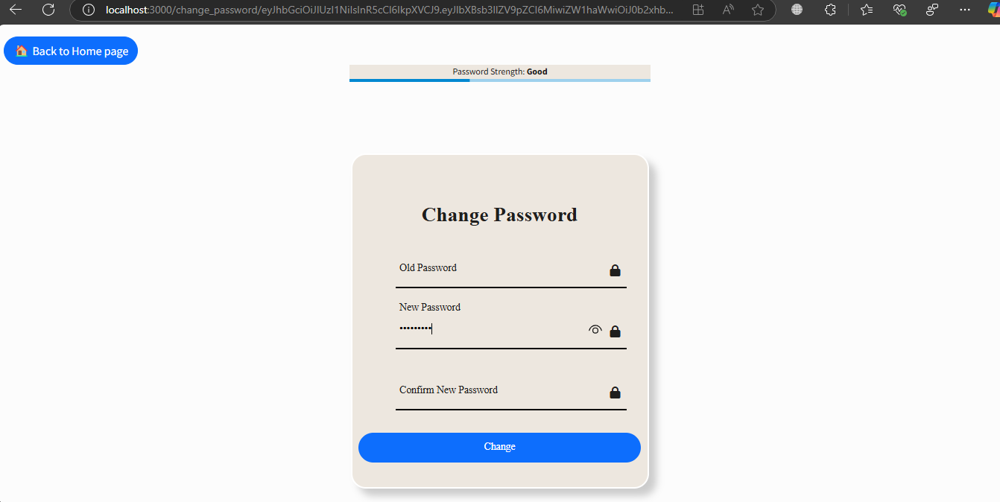

---

---

## User Roles and Permissions

### Overview

The system has four distinct roles: **Admin**, **Manager**, **Employee**, and **Attendance Taker**. Each role has specific permissions and capabilities within the system to ensure smooth operation and delegation of tasks.

### Role Details

#### **Admin**
- **Permissions:**
  - **Full Access:** The Admin has complete access to all system features and functionalities.
  - **Manage Users:** Can create, edit, and delete any user account (Employee, Manager, Attendance Taker).
  - **User Management:** Can assign roles to users and modify role permissions.
  - **View All Data:** Has access to all employee performance, leave requests, attendance, and other records across the system.
  - **Configure System Settings:** Can change system-wide settings and configurations.
  - **Push Notifications:** Admin can send notifications to all users within the system.
  
  **Key Functions:**
  - **Manage Employees:** Add new employees, update employee information, and assign roles.
  - **Approve/Reject Leave Requests:** Admin can approve or reject leave requests for any employee.
  - **View All Performance Reviews:** Admin has visibility over all employee performance data.

#### **Manager**
- **Permissions:**
  - **Supervise Employees:** Managers can oversee the employees under their department.
  - **Approve/Reject Leave Requests:** Managers can approve or reject leave requests for employees under their supervision.
  - **Department Changes:** Can change department assignments for their employees.
  - **Employee Upgrades:** Managers can promote or upgrade employees based on performance or other criteria.
  - **Review Performance:** Can give performance reviews to employees and review their performance data.
  - **Push Notifications:** Can send notifications to employees within their department or team.
  
  **Key Functions:**
  - **Approve Leave Requests:** Approve or reject leave requests submitted by employees in their department.
  - **Give Performance Feedback:** Review employee performance and provide feedback.
  - **Department Changes:** Move employees from one department to another within the organization.
  - **Send Notifications:** Managers can send internal team updates or reminders to their employees.

#### **Employee**
- **Permissions:**
  - **Request Leave:** Employees can submit leave requests, which will be reviewed by their manager or admin.
  - **View Their Performance:** Employees can view their performance records and feedback provided by their managers.
  - **View Push Notifications:** Employees can read any notifications sent to them by the admin or manager.
  - **Complete Tasks:** Employees will be assigned tasks and will be required to complete them (this feature is coming soon).
  
  **Key Functions:**
  - **Request Leave:** Employees can apply for leave through the system, which will be reviewed by their manager.
  - **View Performance Reviews:** Employees can view feedback on their performance provided by their managers or admins.
  - **Receive Notifications:** Employees can view notifications about important updates or tasks.
  - **Pending Feature (Task Management):** In the near future, employees will be able to view and complete tasks assigned to them.

#### **Attendance Taker**
- **Permissions:**
  - **Take Attendance:** Attendance takers can mark attendance for employees.
  - **Ask for Leave:** Attendance takers can request leave as needed.
  
  **Key Functions:**
  - **Take Employee Attendance:** Attendance takers are responsible for tracking the attendance of employees on a daily basis.
  - **Request Leave:** Similar to employees, attendance takers can submit leave requests, which will be reviewed by their manager.

### Summary of Permissions by Role

| **Feature/Permission**               | **Admin** | **Manager** | **Employee** | **Attendance Taker** |
|--------------------------------------|-----------|-------------|--------------|----------------------|
| Create and Manage Users              | Yes       | No(only Manage Employee under his supervision)          | No           | No                   |
| Approve/Reject Leave Requests        | Yes       | Yes         | No           | No                   |
| View and Review Employee Performance | Yes       | Yes         | Yes          | No                   |
| Change Employee Department           | Yes       | No         | No           | No                   |
| Employee Promotions/Upgrades         | Yes       | Yes         | No           | No                   |
| Send Notifications                   | Yes       | Yes         | No           | No                   |
| Request Leave                        | Yes       | Yes         | Yes          | Yes                  |
| Take Attendance                      | Yes       | No          | No           | Yes                  |
| View Notifications                   | Yes       | Yes         | Yes          | Yes                   |

---

# Some Major pages Overview
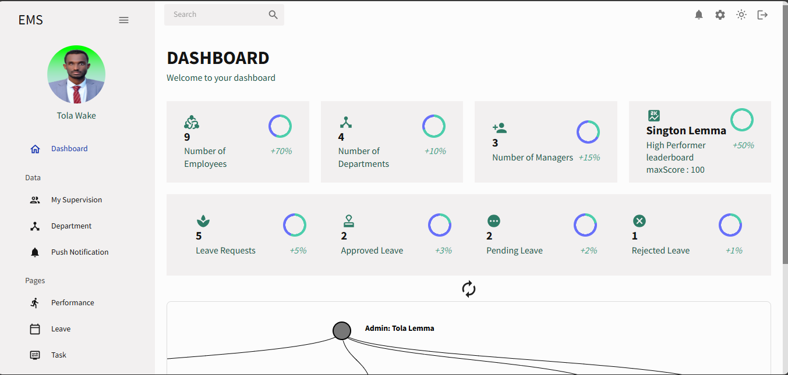
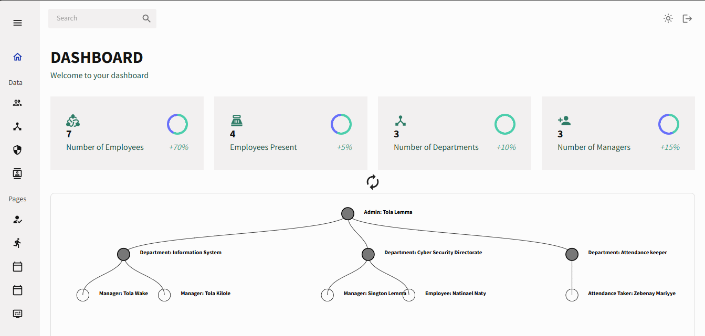
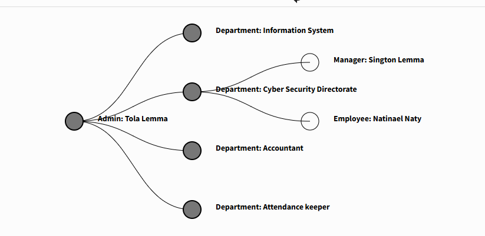
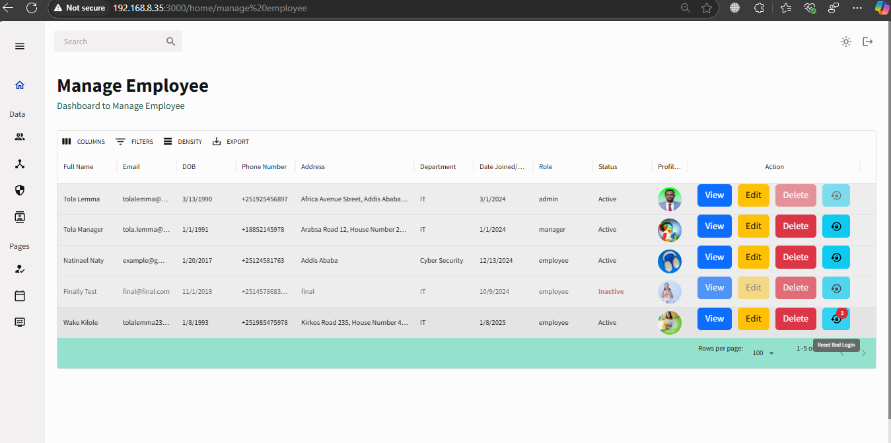
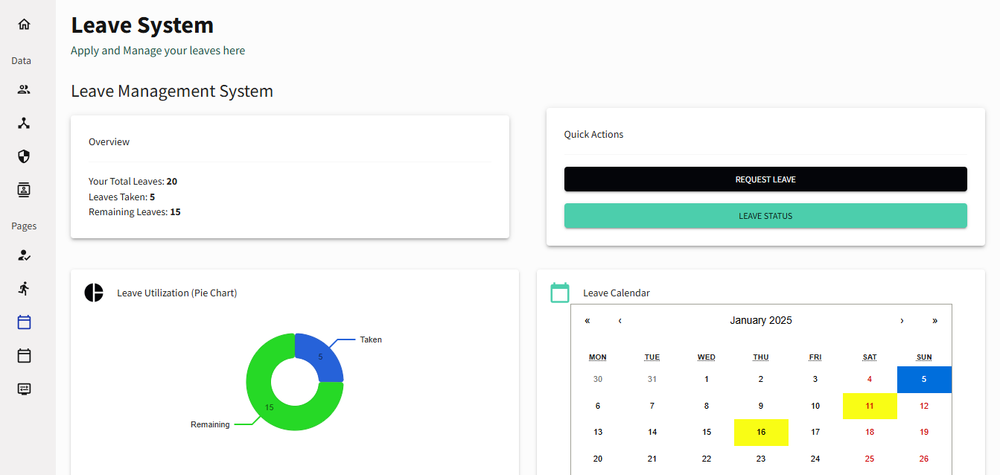
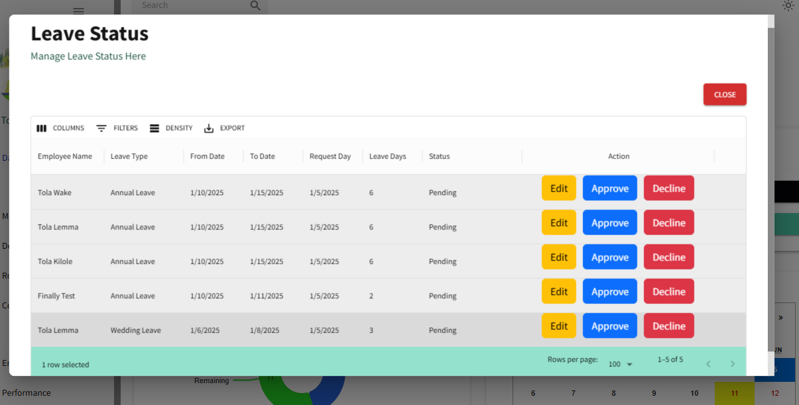
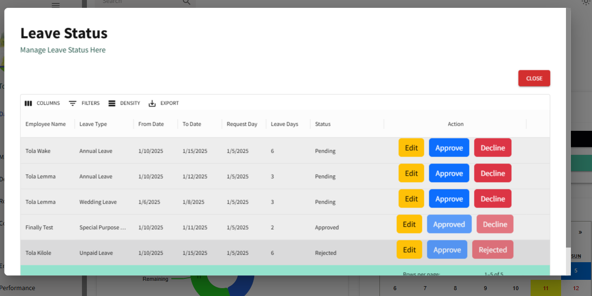
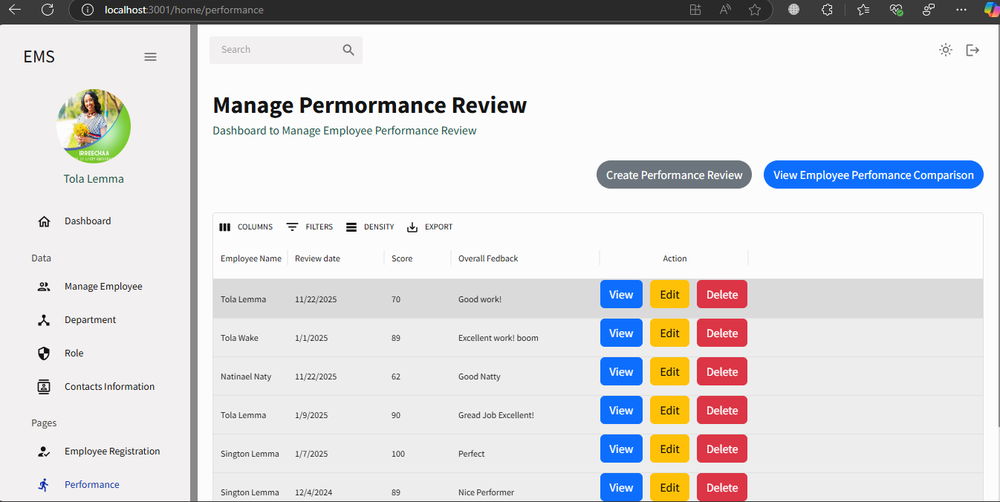
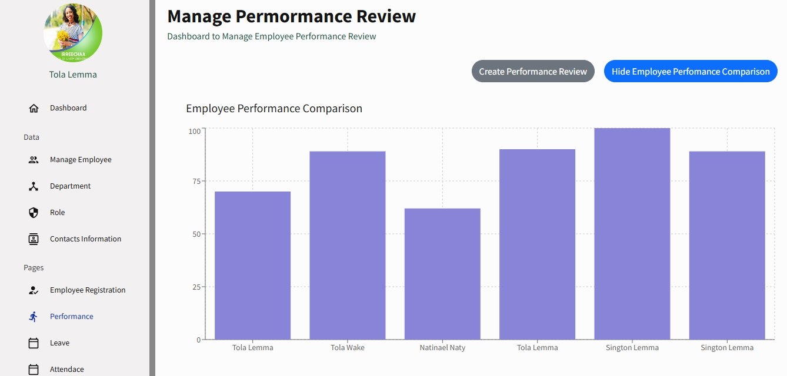
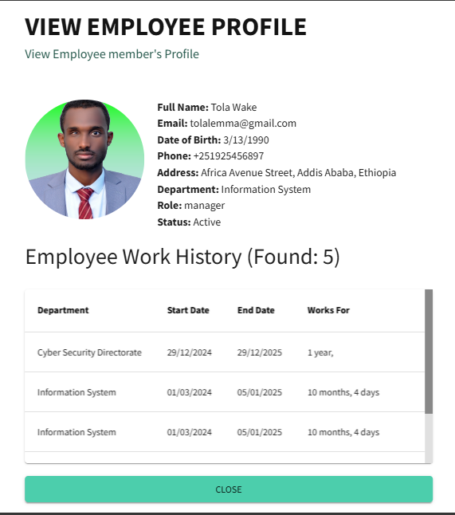
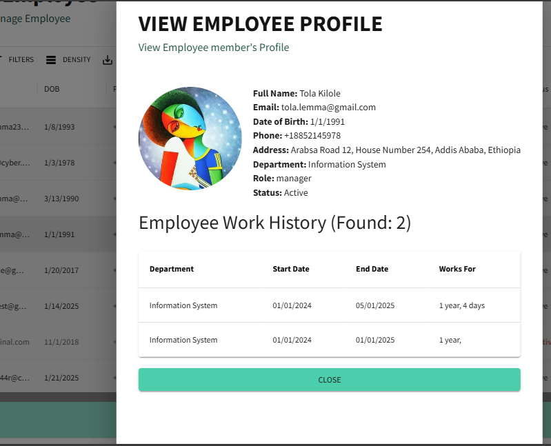
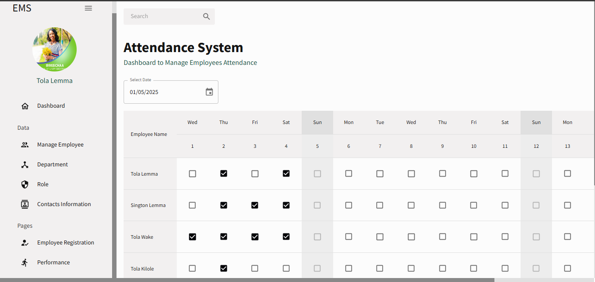
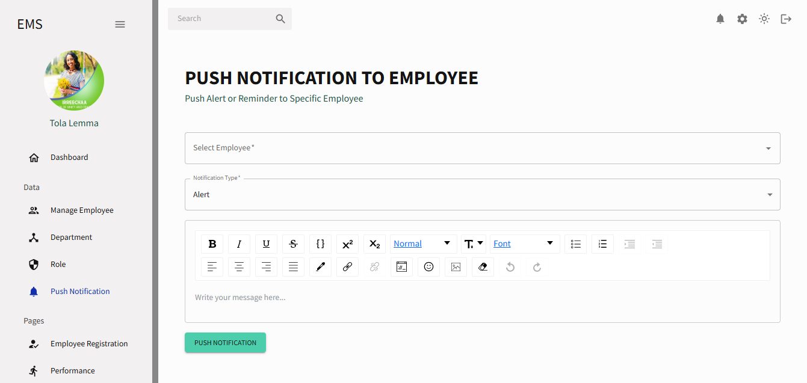
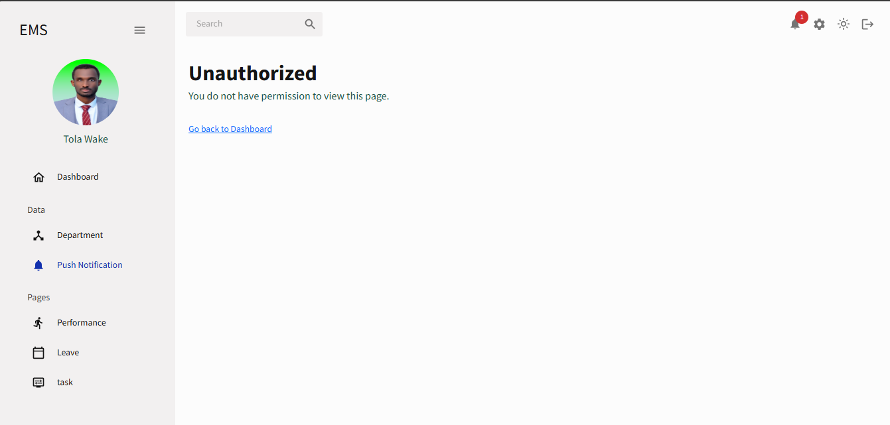
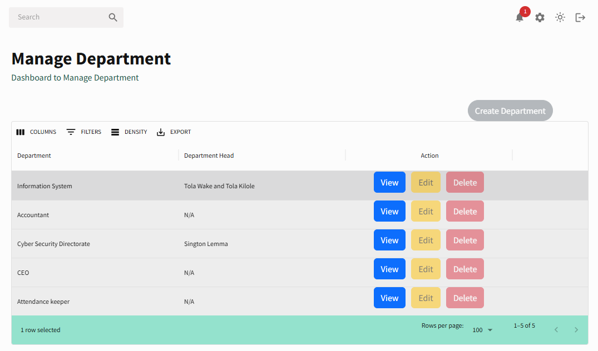
